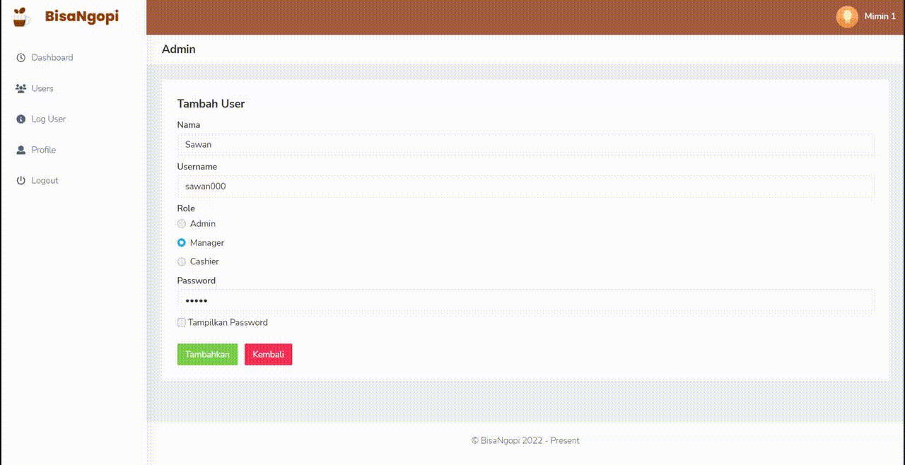
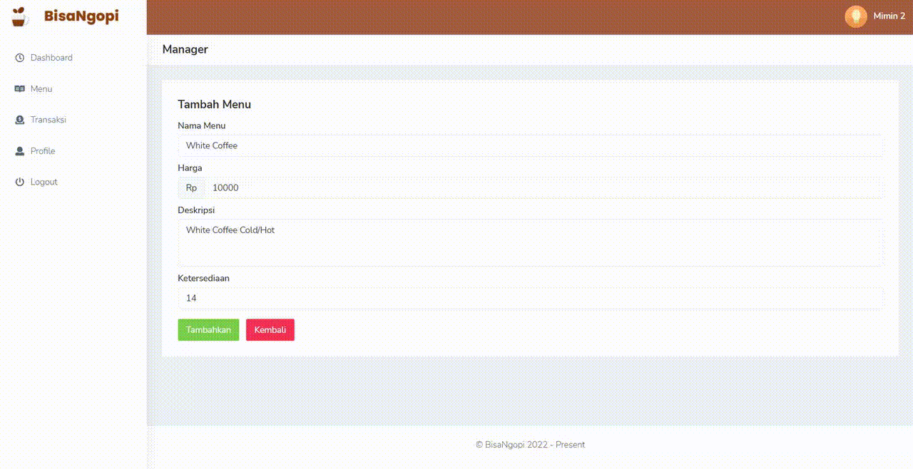
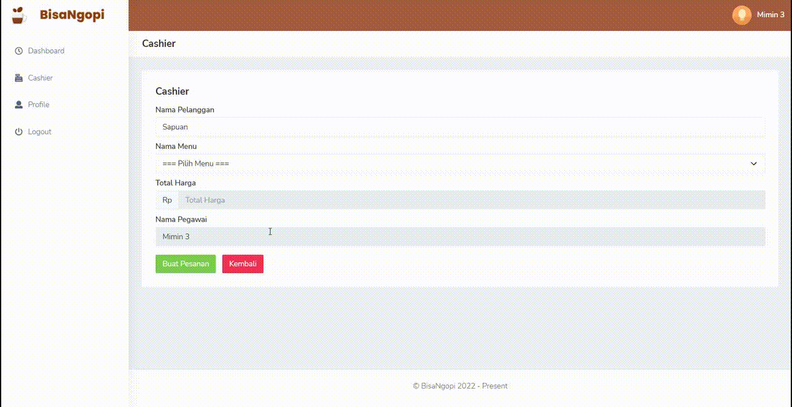

    

<h1 align="center">
    BisaNgopi Cashier App
</h1>

    This project have 3 roles :

- Admin
- Manager
- Cashier

Here are some demos :

<h3>1. Admin</h3>

<h3>2. Manager</h3>

<h3>3. Cashier</h3>

## Clone This Repository

- Run `git clone https://github.com/Syafwan000/bisa-ngopi` on your cmd or terminal
- Go to the folder application using `cd` command on your cmd or terminal
- Run `composer install` on your cmd or terminal
- Copy `.env.example` file to `.env` on the root folder
- Open your `.env` file and change the database name (`DB_DATABASE`) to whatever you have, username (`DB_USERNAME`) and password (`DB_PASSWORD`) field correspond to your configuration
- Run `php artisan key:generate`
- Run `php artisan migrate`
- Run `php artisan serve`
- Go to http://localhost:8000/
